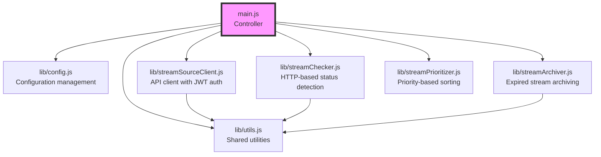

# StreamSource Live Checker - Technical Documentation for AI Assistants

This document provides comprehensive technical information about the StreamSource Live Checker (livesheet-updater) for AI assistants working with the codebase.

## Project Overview

The StreamSource Live Checker is a Node.js service that monitors livestream URLs to detect their live/offline status and automatically archives streams that have been offline for extended periods. It uses the StreamSource API for all operations.

## Architecture Details

### Core Components



### Key Design Decisions

1. **ES Modules**: Uses modern JavaScript modules (`import`/`export`)
2. **Modular Architecture**: Each concern is separated into its own module
3. **Testability**: Functions are exported for unit testing
4. **Error Resilience**: Continues operation despite individual failures
5. **Rate Limiting**: Different intervals for live vs offline streams

## Module Responsibilities

### main.js
- Entry point and orchestration
- Runs infinite loop with configurable delays
- Coordinates all modules
- Handles fatal errors and re-authentication

### lib/config.js
```javascript
export const config = {
  RATE_LIVE: 120000,  // 2 minutes for live streams
  RATE_OFF: 420000,   // 7 minutes for offline streams
  ARCHIVE_ENABLED: false,
  ARCHIVE_THRESHOLD_MINUTES: 30,
  // ... more config
};
```

### lib/streamSourceClient.js
- JWT-based authentication
- Automatic token refresh
- Rate limiting (100 req/min)
- Request retry with exponential backoff
- Response caching (5 minutes)

Key methods:
- `authenticate()` - Gets JWT token
- `getStreams(params)` - Fetches streams with pagination
- `updateStreamStatus(streamId, status)` - Updates stream status
- `getExpiredOfflineStreams(thresholdMinutes)` - Finds archivable streams
- `archiveStream(streamId)` - Archives a stream

### lib/streamChecker.js
- Makes HTTP requests to stream URLs
- Detects platform-specific live indicators
- Handles rate limiting per stream
- Cleans URLs (removes invisible characters)

Platform detection patterns:
- **TikTok**: `"isLiveBroadcast":true`
- **Twitch**: `"isLiveBroadcast":true`, `tw-channel-status-text-indicator`, `"stream":{`
- **YouTube**: `"isLiveBroadcast":"True"` (without `endDate`), `"isLive":true`

### lib/streamArchiver.js
- Finds streams offline for threshold duration
- Archives streams via API
- Validates stream state before archiving
- Returns success/error counts

### lib/streamPrioritizer.js
Priority levels:
- **3**: Never checked (`last_checked_at === null`)
- **2**: Currently live
- **1**: Recently live (within 20 minutes)
- **0**: All other streams

### lib/utils.js
- `log()`: Timestamped console logging
- `debug()`: Conditional debug logging
- `delay()`: Promise-based setTimeout
- `rand()`: Random delay between min/max
- `FETCH_HEADERS`: Browser-like headers for HTTP requests

## Data Flow

1. **Startup**
   - Validate configuration
   - Create StreamSource client
   - Authenticate with API

2. **Main Loop**
   ```mermaid
   flowchart LR
       A[Fetch streams] --> B[Prioritize]
       B --> C[Check status]
       C --> D[Update API]
       D --> E[Archive expired]
       E --> F[Sleep]
       F --> A
   ```

3. **Stream Checking**
   - Skip if checked recently (rate limit)
   - Make HTTP request with browser headers
   - Detect platform and live status
   - Return status update or null

4. **Archiving**
   - Run every 5 minutes (configurable)
   - Find streams offline > threshold
   - Archive via API
   - Log results

## Testing Strategy

### Unit Tests (lib/*.test.js)
- Mock external dependencies
- Test individual functions
- ~95% coverage for lib modules

### Integration Tests (integration.test.js)
- Test module interactions
- Mock API responses
- Test error scenarios

### Manual Testing (scripts/test-archive.js)
- Real API integration testing
- Configurable test scenarios
- Dry-run by default

## Common Development Tasks

### Adding a New Platform
1. Add detection logic to `lib/streamChecker.js`
2. Update `detectLiveStatus()` function
3. Add test cases
4. Update documentation

### Changing Check Intervals
1. Update defaults in `lib/config.js`
2. Document in README.md
3. Update `.env.example`

### Adding New API Endpoints
1. Add method to `streamSourceClient.js`
2. Handle authentication and rate limiting
3. Add caching if appropriate
4. Write tests

## Performance Considerations

- **Memory**: ~50-100MB typical usage
- **CPU**: Minimal, mostly waiting
- **Network**: 1-2 requests per stream per cycle
- **API Calls**: Respects 100 req/min limit

## Error Handling

### Recoverable Errors
- Individual stream check failures
- Temporary network issues
- 429 rate limit responses
- WAF/challenge pages

### Re-authentication Triggers
- 401 Unauthorized responses
- Token expiration

### Fatal Errors
- Missing credentials
- Persistent API failures
- Unhandled exceptions

## Environment Variables

Required:
- `STREAMSOURCE_EMAIL`
- `STREAMSOURCE_PASSWORD`

Optional with defaults:
- `STREAMSOURCE_API_URL` (https://api.streamsource.com)
- `RATE_LIVE` (120000 ms)
- `RATE_OFF` (420000 ms)
- `ARCHIVE_ENABLED` (false)
- `ARCHIVE_THRESHOLD_MINUTES` (30)
- `ARCHIVE_CHECK_INTERVAL` (300000 ms)
- `DEBUG` (false)

## Docker Configuration

```dockerfile
FROM node:18-alpine
WORKDIR /app
COPY package*.json ./
RUN npm ci --only=production
COPY . .
CMD ["node", "main.js"]
```

Minimal container with:
- Node.js 18 Alpine base
- Production dependencies only
- Direct node execution (no npm)

## Debugging Tips

1. **Enable Debug Logging**
   ```bash
   DEBUG=true npm start
   ```

2. **Test Specific Streams**
   ```javascript
   // In lib/streamChecker.js, add:
   if (stream.id === 123) console.log('Debug:', stream);
   ```

3. **Monitor API Calls**
   - Check `requestCount` in streamSourceClient
   - Log response headers for rate limits

4. **Test Without Archiving**
   ```bash
   ARCHIVE_ENABLED=false npm start
   ```

## Technical Details

Key features:
- StreamSource API integration for all operations
- Efficient rate-limited checking
- Automatic stream archiving
- Added archiving functionality
- Improved error handling

## Future Enhancements

Potential improvements:
1. WebSocket support for real-time updates
2. Metrics collection (Prometheus/StatsD)
3. Multi-threaded checking
4. Platform-specific optimizations
5. Health check endpoint

## Security Considerations

- JWT tokens are never logged
- Credentials only in environment variables
- No sensitive data in error messages
- HTTPS only for API communication
- Rate limiting prevents abuse

## Related Services

Part of the Streamwall Suite:
- **StreamSource**: Rails API backend (source of truth)
- **Streamwall**: Electron display application
- **livestream-link-monitor**: Discord/Twitch URL monitor

Integration points:
- All services use StreamSource API
- JWT authentication shared
- Same stream data model
- Coordinated via API updates

## Quick Reference

### Start the service
```bash
npm start
```

### Run tests
```bash
npm test
npm run test:coverage
```

### Manual testing
```bash
node scripts/test-archive.js
```

### Check logs
```bash
docker-compose logs -f
```

### Common issues
- Missing credentials → Set environment variables
- 429 errors → Increase rate limits
- No streams checked → Verify API connection

---

This document should provide comprehensive context for AI assistants working with the StreamSource Live Checker codebase. For user-facing documentation, see README.md.