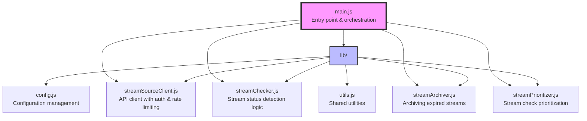
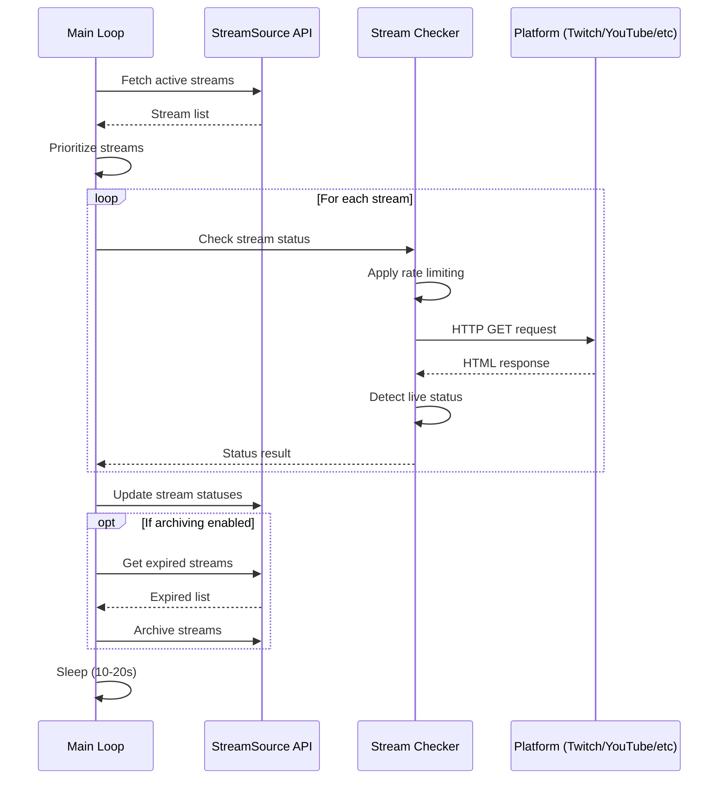

# StreamSource Live Checker (formerly livesheet-updater)

A Node.js service that monitors livestream statuses and archives expired streams using the StreamSource API. This service periodically checks if streams are live or offline and maintains accurate status information.

## 📋 Table of Contents

- [Overview](#overview)
- [Features](#features)
- [Architecture](#architecture)
- [Prerequisites](#prerequisites)
- [Installation](#installation)
- [Configuration](#configuration)
- [Usage](#usage)
- [Development](#development)
- [Testing](#testing)
- [Deployment](#deployment)
- [Monitoring](#monitoring)
- [Troubleshooting](#troubleshooting)
- [Contributing](#contributing)

## 🎯 Overview

The StreamSource Live Checker is a critical component of the Streamwall Suite that:
- Continuously monitors stream URLs to detect live/offline status
- Prioritizes checks based on stream state and last check time
- Automatically archives streams that have been offline for extended periods
- Integrates with the StreamSource API for centralized stream management

## ✨ Features

- **Smart Prioritization**: Never-checked and currently-live streams get priority
- **Configurable Rate Limiting**: Different check intervals for live vs offline streams
- **Automatic Archiving**: Archives streams offline for 30+ minutes (configurable)
- **Platform Support**: Detects live status for Twitch, YouTube, TikTok, Kick, and Facebook
- **Resilient Error Handling**: Continues operation despite individual stream check failures
- **Docker Support**: Easy deployment with Docker and docker-compose
- **Comprehensive Testing**: 90%+ code coverage with unit and integration tests

## 🏗 Architecture



### Module Responsibilities

- **main.js**: Orchestrates the main loop, coordinates all modules
- **config.js**: Centralizes configuration and validation
- **streamSourceClient.js**: Handles all StreamSource API interactions with JWT auth
- **streamChecker.js**: Detects stream status by making HTTP requests
- **streamArchiver.js**: Archives streams offline for threshold duration
- **streamPrioritizer.js**: Sorts streams by check priority
- **utils.js**: Logging, delays, and shared constants

## 📋 Prerequisites

- Node.js 18+ (uses ES modules)
- StreamSource API credentials
- Docker & Docker Compose (for containerized deployment)

## 🚀 Installation

### Local Development

```bash
# Clone the repository
git clone https://github.com/streamwall/streamwall-suite.git
cd streamwall-suite/livesheet-updater

# Install dependencies
npm install

# Copy environment template
cp .env.example .env

# Edit .env with your credentials
nano .env
```

### Docker Installation

```bash
# Clone and navigate to directory
git clone https://github.com/streamwall/streamwall-suite.git
cd streamwall-suite/livesheet-updater

# Copy and configure environment
cp .env.example .env
nano .env

# Build and run with Docker Compose
docker-compose up -d
```

## ⚙️ Configuration

### Environment Variables

Create a `.env` file with the following variables:

```env
# StreamSource API Configuration (Required)
STREAMSOURCE_API_URL=https://api.streamsource.com
STREAMSOURCE_EMAIL=your@email.com
STREAMSOURCE_PASSWORD=your-password

# Rate Limiting (Optional)
RATE_LIVE=120000        # Check interval for live streams (ms) - default: 2 minutes
RATE_OFF=420000         # Check interval for offline streams (ms) - default: 7 minutes

# Archiving Configuration (Optional)
ARCHIVE_ENABLED=true    # Enable automatic archiving - default: false
ARCHIVE_THRESHOLD_MINUTES=30  # Minutes offline before archiving - default: 30
ARCHIVE_CHECK_INTERVAL=300000 # How often to check for expired streams (ms) - default: 5 minutes

# Debug Mode (Optional)
DEBUG=false             # Enable debug logging - default: false
```

### Priority System

Streams are checked in the following priority order:
1. **Priority 3**: Never checked streams
2. **Priority 2**: Currently live streams
3. **Priority 1**: Recently live streams (within 20 minutes)
4. **Priority 0**: All other offline streams

### Stream Checking Process



## 🖥 Usage

### Running Locally

```bash
# Run with npm
npm start

# Run with environment variables inline
STREAMSOURCE_EMAIL=test@example.com STREAMSOURCE_PASSWORD=pass npm start

# Run with debug logging
DEBUG=true npm start
```

### Running with Docker

```bash
# Start the service
docker-compose up -d

# View logs
docker-compose logs -f

# Stop the service
docker-compose down
```

### Manual Testing

Test the archiving functionality without running the full service:

```bash
# Test authentication and stream fetching
npm run test:archive

# Test with custom threshold
TEST_THRESHOLD_MINUTES=60 npm run test:archive

# Actually archive a stream (dry run by default)
TEST_ARCHIVE=true npm run test:archive
```

## 🛠 Development

### Project Structure

```
livesheet-updater/
├── lib/                    # Core modules
│   ├── config.js          # Configuration management
│   ├── streamArchiver.js  # Archiving logic
│   ├── streamChecker.js   # Status checking logic
│   ├── streamPrioritizer.js # Priority algorithm
│   ├── streamSourceClient.js # API client
│   ├── utils.js           # Utilities
│   └── *.test.js          # Unit tests for each module
├── scripts/               # Utility scripts
│   └── test-archive.js    # Manual testing script
├── main.js               # Entry point
├── main.test.js          # Main module tests
├── integration.test.js   # Integration tests
├── docker-compose.yml    # Docker configuration
├── Dockerfile           # Container definition
├── package.json         # Dependencies
└── jest.config.js       # Test configuration
```

### Adding New Features

1. Create new modules in `lib/` directory
2. Export functions for testing
3. Add corresponding `.test.js` files
4. Update main.js to use new functionality
5. Update documentation

### Code Style

- ES modules (import/export)
- Async/await for asynchronous code
- JSDoc comments for functions
- Descriptive variable names
- Early returns for error cases

## 🧪 Testing

### Running Tests

```bash
# Run all tests
npm test

# Run tests in watch mode
npm run test:watch

# Run tests with coverage
npm run test:coverage

# Run specific test file
npm test lib/streamChecker.test.js
```

### Test Coverage

Current coverage: ~90% overall

- Unit tests for all modules in `lib/`
- Integration tests for end-to-end workflows
- Mock external dependencies (API calls, fetch)

### Writing Tests

```javascript
// Example test structure
import { jest, describe, test, expect } from '@jest/globals';

describe('Module Name', () => {
  test('should do something', async () => {
    // Arrange
    const input = { /* test data */ };
    
    // Act
    const result = await functionToTest(input);
    
    // Assert
    expect(result).toEqual(expectedOutput);
  });
});
```

## 🚀 Deployment

### Docker Deployment

```bash
# Build image
docker build -t streamsource-checker .

# Run container
docker run -d \
  --name streamsource-checker \
  --env-file .env \
  --restart unless-stopped \
  streamsource-checker
```

### Docker Compose Deployment

```yaml
# docker-compose.yml
version: '3.8'
services:
  checker:
    build: .
    env_file: .env
    restart: unless-stopped
    logging:
      driver: "json-file"
      options:
        max-size: "10m"
        max-file: "3"
```

### Production Considerations

1. **Logging**: Configure log rotation to prevent disk space issues
2. **Monitoring**: Set up health checks and alerts
3. **Resources**: Minimal requirements - 256MB RAM, 0.5 CPU
4. **Networking**: Ensure outbound HTTPS access to stream platforms
5. **Security**: Use secrets management for credentials

## 📊 Monitoring

### Health Checks

The service logs its activity continuously. Monitor for:
- "StreamSource Live Checker started" - Service startup
- "Connected to StreamSource API" - Successful authentication
- "Cycle complete" messages - Normal operation
- Error messages - Issues requiring attention

### Metrics to Track

- Streams checked per cycle
- API response times
- Archive operations performed
- Error rates by platform
- Authentication failures

### Example Monitoring Setup

```bash
# Watch logs for errors
docker-compose logs -f | grep -E "ERROR|Failed|error"

# Count checked streams
docker-compose logs | grep "Status:" | wc -l

# Monitor memory usage
docker stats streamsource-checker
```

## 🔧 Troubleshooting

### Common Issues

#### Authentication Failures
```
Error: StreamSource credentials required
```
**Solution**: Ensure STREAMSOURCE_EMAIL and STREAMSOURCE_PASSWORD are set in .env

#### Rate Limiting
```
429 Too Many Requests
```
**Solution**: Increase RATE_LIVE and RATE_OFF values in configuration

#### Network Errors
```
Request error: Network error
```
**Solution**: Check internet connectivity and firewall rules

#### Challenge/WAF Pages
```
WARNING: Received challenge/WAF page
```
**Solution**: This is expected for some platforms; the service will retry later

### Debug Mode

Enable debug logging for more detailed information:

```bash
DEBUG=true npm start
```

### Manual Database Queries

If you need to check the StreamSource database directly:

```sql
-- Find streams not checked recently
SELECT id, link, status, last_checked_at 
FROM streams 
WHERE last_checked_at < NOW() - INTERVAL '1 hour'
ORDER BY last_checked_at;

-- Find expired offline streams
SELECT id, link, last_live_at 
FROM streams 
WHERE status IN ('offline', 'unknown') 
  AND last_live_at < NOW() - INTERVAL '30 minutes';
```

## 🤝 Contributing

1. Fork the repository
2. Create a feature branch (`git checkout -b feature/amazing-feature`)
3. Write tests for new functionality
4. Ensure all tests pass (`npm test`)
5. Commit changes (`git commit -m 'Add amazing feature'`)
6. Push to branch (`git push origin feature/amazing-feature`)
7. Open a Pull Request

### Development Guidelines

- Maintain test coverage above 85%
- Follow existing code patterns
- Update documentation for new features
- Add JSDoc comments for new functions
- Keep functions small and focused

## 📄 License

This project is part of the Streamwall Suite. See the main repository for license information.

## 🔗 Related Projects

- [StreamSource](https://github.com/streamwall/streamsource) - API backend
- [Streamwall](https://github.com/streamwall/streamwall) - Display application
- [Livestream Link Monitor](https://github.com/streamwall/livestream-link-monitor) - Discord/Twitch monitor

---

For more technical details and AI assistant information, see [CLAUDE.md](CLAUDE.md)